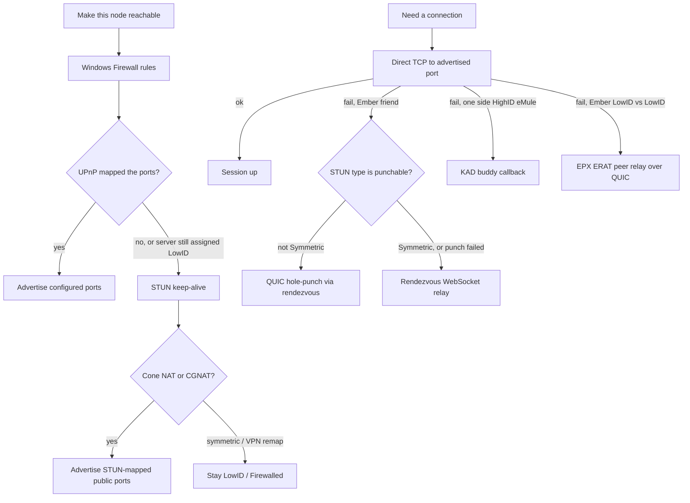

# NAT traversal — do we need QUIC, STUN, and the rest?

Short answer: **a given session only uses a subset, but the stack as a
whole is not redundant.** Each piece covers a different network, a
different NAT class, or a different peer population. Dropping one does
not make another take over; it just leaves a hole.

The features that look similar from the Settings page — UPnP, STUN
keep-alive, KAD firewall status, QUIC hole-punch, peer relay — are
layered fallbacks, not alternate implementations of the same thing.

---

## What each piece actually does

### 1. Windows Firewall rules — host, not NAT

[`src-tauri/src/security/firewall.rs`](../src-tauri/src/security/firewall.rs)
adds inbound Windows Defender Firewall rules for the TCP and UDP listen
ports. This is the OS packet filter on the same machine as Ember. A
router forward or a STUN mapping is useless if Windows drops the packet
before Ember sees it.

No overlap with STUN or QUIC. Windows-only; Linux relies on the user
(or the distro package) to open the ports.

### 2. UPnP — install a real inbound forward

[`src-tauri/src/network/upnp.rs`](../src-tauri/src/network/upnp.rs) asks
the home gateway to forward TCP (file transfers), KAD UDP (4672 by
default; Ember DHT shares that socket), and the QUIC UDP port once that
endpoint has bound.

UPnP is the only mechanism that *creates* an inbound mapping on a
typical consumer router. STUN cannot do that: it only observes the
mapping a NAT already made for an *outbound* packet. The advertise
order in `advertised_tcp_port` therefore prefers a live UPnP mapping
over a STUN-mapped port, except when the eD2K server has already
assigned LowID — that is evidence the UPnP forward is not actually
carrying traffic (CGNAT in front of a UPnP-capable inner router is the
usual case), so STUN wins until a HighID proves the forward works.

Default is **off** (`upnp_enabled: false`); the setup wizard offers it.
Keep it as a user choice: some routers implement UPnP badly, and some
users already forward by hand.

### 3. KAD FirewallChecker — eMule protocol, not a STUN substitute

[`src-tauri/src/network/kad/firewall.rs`](../src-tauri/src/network/kad/firewall.rs)
is the eMule KAD firewall check: ask several contacts to connect back
(`FirewalledReq` / `FirewalledRes`) and vote on the observed external
IP and UDP port. The result is the **KAD Firewalled** flag on the
Network page, which gates buddy selection and how this node publishes.

This cannot be replaced by STUN:

- Other eMule / aMule clients speak this opcode and expect it. Ember
  has to as well, or it is not a KAD peer.
- Votes are weighted by distinct `/24` so a Sybil cluster cannot pick
  our advertised IP. A public STUN reflector does not give that.
- eD2K LowID (TCP, judged by the server) and KAD Firewalled (UDP,
  judged by peers) are independent. HighID and Firewalled at once is
  legitimate.

STUN keep-alive is deliberately not allowed to be overwritten by a
stale KAD UDP-port vote while a STUN mapping is live
(`stun_udp_mapping_active`).

### 4. STUN NAT-type probe — decide whether to punch

[`src-tauri/src/network/ember/nat.rs`](../src-tauri/src/network/ember/nat.rs)
sends Binding requests to several public reflectors (Google,
Cloudflare, Twilio) and classifies the NAT: Open, Full Cone,
Restricted, Port-Restricted, Symmetric, or Unknown.

That classification is the gate on Ember hole-punch. The live check is
`nat_type != Symmetric` on *our* side — we only learn the peer's type
after the punch request is already in flight. Symmetric NAT remaps the
external port per destination, so a coordinated punch at a STUN-learned
port will not land.

If every reflector fails, a HighID plus a confirmed TCP connect-back is
treated as an optimistic `PortRestricted` guess so friends on an
otherwise punchable link are not forced straight to relay.

This is **not** the same code path as keep-alive. The probe is
classification (every ~5 minutes). Keep-alive is mapping refresh
(every 20 seconds) and public-port advertisement.

### 5. STUN mapping keep-alive — CGNAT / full-cone without UPnP

[`src-tauri/src/network/ember/mapping_keepalive.rs`](../src-tauri/src/network/ember/mapping_keepalive.rs):

- UDP: Binding requests from the real KAD listen socket, so the mapping
  that is refreshed is the one KAD and Ember DHT actually use.
- TCP: `SO_REUSEADDR` connect from the listen port (a short hold to
  keep the mapping) plus STUN-over-TCP from that same local endpoint to
  learn the public TCP port. Google's UDP STUN servers do not speak
  TCP, so the TCP list is separate.

On by default. Auto-suspends on Open internet (nothing to refresh) and
on Symmetric / unstable remapping (advertising a per-destination port
would make every connect-back miss). Aimed at CGNAT and full-cone home
NATs where UPnP is missing or lies; that is the
[CGNAT / NAT1](https://github.com/untaimed18/Ember-P2P/issues/41) case.

Without this, those nodes stay LowID even when the NAT would have
accepted inbound on the mapped port.

### 6. QUIC — Ember-only UDP transport for punch and relay

[`src-tauri/src/network/ember/quic.rs`](../src-tauri/src/network/ember/quic.rs)
is a Quinn endpoint with an Ed25519 identity-bound self-signed cert
(ALPN `ember/1`). It binds its **own** UDP socket, usually on
`tcp_port`, with a few neighbour-port fallbacks if that UDP port is
already taken by KAD. It does **not** share the KAD/Ember-DHT socket.

QUIC is used for:

- Coordinated hole-punch between Ember identities (friends, and friend
  file transfers). UDP punch succeeds on far more cone NATs than TCP
  simultaneous-open.
- Peer-relay sessions: the third Ember node that agreed to carry
  LowID↔LowID bytes (`relay.rs` accept loop and `connect_to_peer_relay`).

It is **not** a general replacement for eD2K TCP. Content still moves
on the eMule wire once a stream is up (`secure_stream` is the inner
protocol; QUIC is one outer carrier alongside TCP and the WebSocket
relay). Anonymous KAD/server sources have no Ember identity, so the
download broker does not punch them — it goes straight to peer relay
([`broker.rs`](../src-tauri/src/network/ember/broker.rs)).

Drop QUIC and Ember-to-Ember punch plus peer-relay both disappear.
Friends can still fall back to the rendezvous WebSocket hop; LowID↔LowID
downloads between strangers cannot.

### 7. Rendezvous punch signaling — QUIC cannot punch alone

Hole-punch needs both sides to know the other's mapped address and to
send at the same time. The rendezvous server
([`rendezvous-server/`](../rendezvous-server/)) is that signaling
channel: signed `/v2/punch` register / poll / ack, keyed by pairwise
friend capabilities rather than a raw Friend ID.

QUIC without this is just another outbound UDP socket. The rendezvous
has **no** role in Ember DHT bootstrap; it is only friend presence,
punch coordination, and the WebSocket relay below.

### 8. Rendezvous WebSocket relay — last hop for friends

When TCP fails and punch is skipped or misses (typical: both sides
Symmetric, or one side has no STUN mapping yet),
`connect_friend_with_fallback` asks the rendezvous for a WebSocket
relay ticket. Restricted to mutually known friends so the server is
not a general traffic proxy.

This is the only path that still works when neither UDP mapping is
stable. It costs the operator bandwidth; peer relay (next) is the
equivalent for file downloads and spends *other users'* bandwidth
instead.

### 9. KAD buddy — eMule LowID, mixed-network peers

[`src-tauri/src/network/kad/buddy.rs`](../src-tauri/src/network/kad/buddy.rs)
is classic eMule: a firewalled node keeps a TCP session to one HighID
buddy, who forwards `OP_CALLBACK` / `OP_REASKCALLBACKTCP` so the
firewalled side can dial *out*. Required for transfers with aMule /
eMule / any client that does not speak Ember QUIC or ERAT.

Buddy needs **one** HighID. Two LowID eMule clients still cannot
connect; that is an eMule-protocol limit, not something STUN or QUIC
can paper over for non-Ember peers.

### 10. EPX ERAT + connection broker — Ember LowID↔LowID downloads

EPX v4 can carry signed relay attestations (`ERAT`). A node with
**Relay for other peers** on (default on) self-signs that it will
carry traffic. The broker collects those candidates and, when two
Ember LowID sources cannot TCP, dials a relay over QUIC.

This is the Ember answer to "both firewalled", which KAD buddy cannot
solve. It is optional to *provide* (`relay_for_peers`); it is not
optional to *have in the protocol* if LowID Ember users are going to
upload to each other.

Firewalled Ember DHT publishing is a separate, related path: buddy
`PROXY_STORE` so a LowID node can still place records. See
[ember-dht.md](ember-dht.md).

---

## Why they are not interchangeable

| If we dropped… | What still works | What breaks |
|---|---|---|
| Windows Firewall rules | Everything behind a non-Windows host or a manually opened rule | Inbound on a default Windows install, even with UPnP/STUN |
| UPnP | Manual forwards; STUN keep-alive on cone/CGNAT | Typical home routers with no hand-forwarded ports |
| KAD FirewallChecker | STUN still learns a public mapping | KAD compatibility, buddy, honest Firewalled status |
| STUN NAT probe | Keep-alive still refreshes mappings | Punch vs relay decision; friends on cone NATs go straight to relay or punch a Symmetric mapping and fail |
| STUN keep-alive | UPnP and manual forwards | CGNAT / full-cone without UPnP stay LowID |
| QUIC | Direct TCP; KAD buddy; friend WebSocket relay | Hole-punch; Ember peer-relay downloads |
| Rendezvous punch | Direct TCP; relay | Coordinated punch (QUIC has nothing to aim at) |
| WebSocket relay | Punch on cone NATs | Friends on Symmetric NAT / double-LowID with no punch |
| KAD buddy | Ember-to-Ember punch/relay | Firewalled transfers with eMule/aMule |
| ERAT peer relay | Buddy when one side is HighID | Ember LowID↔LowID downloads |

STUN and KAD firewall both produce an "external IP/port", but they
measure different things (reflector vs peer connect-back) and feed
different consumers (punch/advertise vs KAD protocol state). UPnP and
STUN keep-alive both try to make you reachable, but one *installs* a
forward and the other *observes* an outbound mapping. KAD buddy and
Ember relay both help firewalled nodes, but they talk to different
peer populations and different topologies (one HighID vs both LowID).

---

## What a user actually needs to turn on

Nothing extra for KAD firewall checks, buddy, QUIC, or punch — those
run as part of Connect. User-facing toggles:

| Setting | Default | When to touch it |
|---|---|---|
| **UPnP** | Off | Turn on if the router supports it and you do not already forward 4662/TCP and 4672/UDP |
| **STUN port keep-alive** | On | Leave on for CGNAT / no-UPnP. Turn off only if outbound STUN is blocked (captive / locked-down LAN) |
| **Relay for other peers** | On | Turn off if you do not want to spend upload on strangers' LowID↔LowID paths |

Symmetric NAT and VPNs that remap unstably still need a VPN (or host)
with a **fixed forwarded port**. The stack will not invent a stable
mapping those NATs refuse to keep.

---

## Code map

| Concern | Module |
|---|---|
| NAT class + UDP STUN Binding | `network/ember/nat.rs` |
| Mapping keep-alive (UDP + TCP STUN) | `network/ember/mapping_keepalive.rs` |
| QUIC endpoint, cert, pin | `network/ember/quic.rs` |
| Punch connect helper | `network/ember/broker.rs` (`punch_quic_pinned`) |
| Peer relay + rendezvous punch HTTP | `network/ember/relay.rs` |
| Friend TCP → QUIC punch → WS relay | `network/ed2k/friend_connect.rs` |
| LowID↔LowID download relay | `network/ember/broker.rs` (`ConnectionBroker`) |
| UPnP TCP / KAD UDP / QUIC UDP | `network/upnp.rs` |
| KAD FirewalledReq/Res | `network/kad/firewall.rs` |
| eMule buddy callback | `network/kad/buddy.rs` |
| Windows inbound rules | `security/firewall.rs` |
| Advertise-port precedence | `network/mod.rs` (`advertised_tcp_port`, `advertised_udp_port`, `advertised_quic_port`) |
